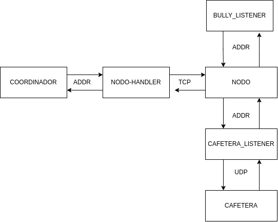
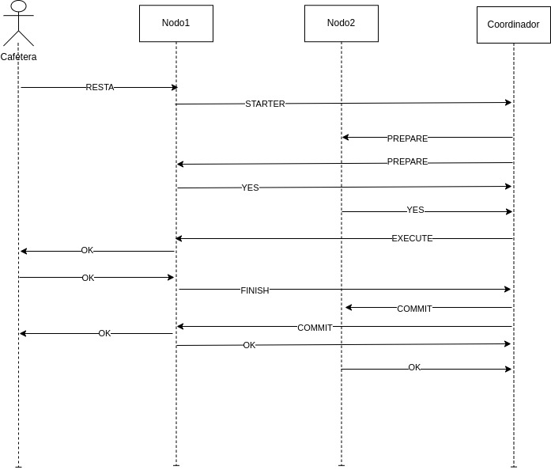
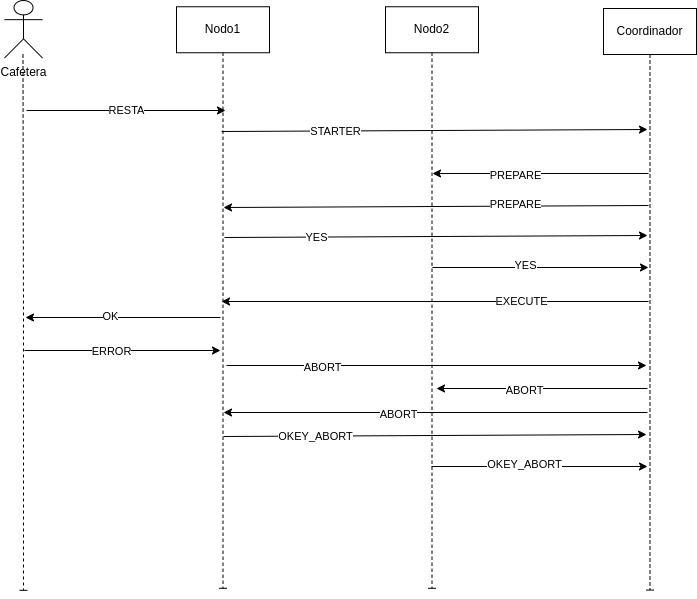
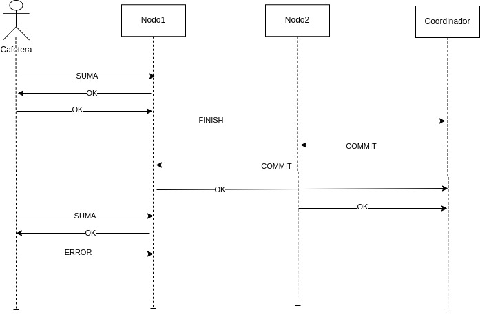
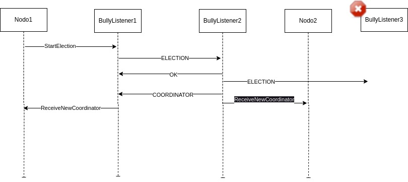
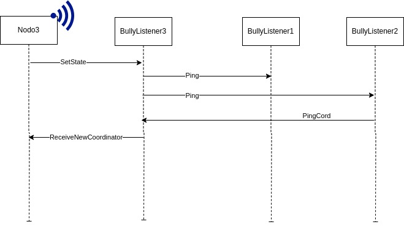

# TP2: Técnicas de Programación Concurrente I

## Ejecución del programa

Se cuenta con tres módulos diferentes para la ejecución de la aplicación:

### Servidor
Situado en el módulo de `/server`. Se encarga de ejecutar los nodos servidores que conforman el sistema distribuido para representar una base de datos de puntos distribuida.

El mismo se lo ejecuta como:

```bash
$ cd /server && cargo run -- <ID_NODO>
``` 

Al mismo se le debe indicar el número de ID del nodo (mayor a 0) que se desea levantar. La cantidad de nodos máxima que habrá en el sistema será fija al momento de ejecución que se la puede indicar mediante la constante `CANT_MAX_NODOS` del archivo `/server/src/utils.rs`. Por default se tiene una cantidad máxima de 3 nodos por ende se podrá levantar los nodos con ID 1, 2, y 3 pero el sistema permite procesar pedidos aunque se levanten dos nodos o inclusive un solo nodo. 

Por supuestos se toma como el `ID_CORDINADOR_INICIAL` el primer servidor que se debera levantar del sistema distribuido (en este caso si fuese el id 1 como coordenador inicial, se debera levantar primero el nodo con ID_NODO = 1 y luego los demas nodos para que se conecten al coordinador iniciado).

### Sucursal
Situado en el módulo de `/sucursal`. Representa el local (o sucursal mejor dicho) donde se conectará mediante un ID_NODO a algún servidor levantado del sistema distribuido. Cada local tendrá diferentes cafeteras que se lo puede especificar mediante la constante `CANTIDAD_CAFETERAS` en `/sucursal/src/utils.rs`; estas cafeteras se disparan en cada thread independiente del proceso sucursal levantado, y cada cafetera se encargará de procesar los diferentes pedidos de café especificados en el archivo de pedidos (que se lo debe indicar al momento de levantar la sucursal al igual que el ID_NODO al que se conectara).

El mismo se lo ejecuta como:

```bash
$ cd /sucursal && cargo run -- <ID_NODO> <archivo_pedido.txt>
```

Los pedidos que procesa cada sucursal se encuentran en la carpeta `/sucursal/Pedidos`. 
Tambien en `/sucursal/src/utils.rs` se encuentran los las constantes de configuración de la sucursal como lo son el `TIMEOUT` (espera maxima para recibir una respuesta por el socket udp), la `PROBABILIDAD_ERROR` (probabilidad que la preparacion del cafe falle) y el `TIEMPO_DE_PREPARACION` (tiempo destinado a la preparacion del cafe).
 

### Desconexión
Situado en el módulo de `/desconexion`. Se encarga de simular la desconexión y reconexión de los servidores.
El mismo se lo ejecuta como:

```bash
$ cd /desconexion && cargo run
```

Y va a solicitar por consola que se especifique la acción a realizar ("d" para desconexión y "c" para conectar) y el nodo a desconectar/conectar. Por ejemplo al levantar con cargo run se puede desconectar y reconectar el servidor nodo con ID_NODO = 1 de la siguiente manera:

```bash
$ cd /desconexion && cargo run
> Ingrese la acción a realizar (d/c) seguido del ID_NODO a realizar la acción: 
d 1
> Ingrese la acción a realizar (d/c) seguido del ID_NODO a realizar la acción: 
c 1
```

## Casos de prueba 

No se conto con tiempo suficiente para realizar pruebas unitarias e integrales mediante el framework de testing de Rust. 

Aun asi, se realizaron pruebas manuales de la aplicación mediante la ejecución de los diferentes módulos y se pudo comprobar el correcto funcionamiento del sistema distribuido de forma consistente:

### Prueba 1: todas sumas para mismo id cuenta

Al tener tres nodos servidores, y ejecutando la sucursal mediante:

```bash
$ cd /sucursal && cargo run -- <ID_NODO> prueba1.txt
```

Si la `PROBABILIDAD_ERROR` de la sucursal es 0, se puede comprobar que se ejecutann las transacciones de suma de puntos de forma consistente replicandose en los tres nodos servidores. Ademas tal como lo especificado en la explicacion de diseño, no se bloquearan las cuentas en la suma de puntos (que segun enunciado seria el caso donde NO SE PAGA un café con puntos) y se puede ejecutar en diferentes sucursales al mismo tiempo para el mismo ID_CUENTA por no bloquearse dicho ID en todo el sistema distribuido.

Si la `PROBABILIDAD_ERROR` de la sucursal no es 0, tambien se puede observar mediante los logs (println!) el saldo de la cuenta de forma consistente en los tres nodos servidores.

### Prueba 2: todas restas para mismo id cuentas

```bash
$ cd /sucursal && cargo run -- <ID_NODO> prueba2.txt
``` 

En esta situacion con probabilidad error 0, se observa el supuesto mencionado y lo solicitado por el enunciado: se bloquea el mismo ID de cuenta en todo el sistema distribuido, no avanza la preparacion de forma "paralela" a pesar de tener multiple servidores ya que cada cafetera al iniciar los pedidos con mismo ids: un servidor inicia la transaccion y por ende toma el lock de la cuenta en el sistema distribuido hasta termina la transaccion. De esta forma, en los servidores se observa como los saldos de las cuentas aparecen de forma consistente en todos los servidores y ademas vemos que por el supuesto de 2PC las operaciones de RESTA son necesariamente atomicas en todo el sistema distribuido, necesitando que el servidor coordinador se encuentre activo para que se pueda realizar la transaccion.

Si se ejecutan al mismo tiempo (en dos terminales distintas) la ejecucion de pedidos:

```bash
$ cd /sucursal && cargo run -- 1 prueba2.txt
``` 

```bash
$ cd /sucursal && cargo run -- 2 prueba2.txt
``` 

Se podra observer la consistencia en la cuenta, bloqueandose la misma en cada ejecucion de transaccion.

### Prueba 3: restas para diferentes id cuentas

```bash
$ cd /sucursal && cargo run -- <ID_NODO> prueba3.txt
```

No se bloquean las cuentas en el sistema distribuido, y se puede ejecutar en diferentes sucursales al mismo tiempo para diferentes ID_CUENTA.

### Prueba 4: dos sumas y resta en mismo id nodo
    
```bash
$ cd /sucursal && cargo run -- <ID_NODO> prueba4.txt
```

NO se bloquean las transacciones; pues empezaran dos sumas, que no bloquean id cuenta por ser suma, pero si se bloqueara en el sistema el tercer pedido imposibilitando que se realize el cuarto pedido de suma.

### Prueba 5: suma y resta misma cantidad pedidos
    
```bash
$ cd /sucursal && cargo run -- <ID_NODO> prueba5.txt
```

Se observa la consistencia de datos en todos los servidores, manteniendo el mismo saldo inicial segun `SALDO_INICIAL` en `/server/src/utils.rs`

### Prueba 6: resta sin saldo
    
```bash
$ cd /sucursal && cargo run -- <ID_NODO> prueba6.txt
```

Con cantidad mayor al `SALDO_INICIAL` en `/server/src/utils.rs` recibe un error la cafetera por no tener suficencia de saldo, pero se ejecuta cuando tiene la misma cantidad al saldo inicial dejando la cuenta con saldo 0.

### Prueba 7: sumas con desconexion de un nodo que no es coordinador

Si matamos al servidor con ID_NODO = 3 que no es coordinador:

```bash
$ cd /desconexion && cargo run
> Ingrese la acción a realizar (d/c) seguido del ID_NODO a realizar la acción: 
d 3
```

Y luego ejecutamos las sumas en ese ID_NODO:

```bash
$ cd /sucursal && cargo run -- 3 prueba7.txt
```

Se podra observar que se realizan los 12 pedidos totalizando una suma 120 de saldo a la cuenta en dicho nodo desconectado. Se ejecuta correctamente la suma de saldo. Esto claramente se podra observar en las terminales de los otros nodos del sistema que no recibe ningun tipo del mensaje COMMIT, nisiquiera el coordinador le recibe el FINISH de las sumas realizadas por el nodo 3.

Al reconectar el nodo:

```bash
$ cd /desconexion && cargo run
> Ingrese la acción a realizar (d/c) seguido del ID_NODO a realizar la acción: 
c 3
```

Se podra observar como el coordiandor recibe el FINISH de parte del nodo desconectado, y el mismo sincronizara los estados de la cuenta comunicando a los nodos restantes que realizen el COMMIT de la transaccion de suma que realizo el nodo en desconexion. De esta forma se mantendra la consistencia de datos en todo el sistema.
Lo mismo se podria replicar si matamos el nodo id 2.


### Prueba 8: sumas y restas con desconexion de un nodo que no es coordinador

Si matamos al servidor con ID_NODO = 3 que no es coordinador:

```bash
$ cd /desconexion && cargo run
> Ingrese la acción a realizar (d/c) seguido del ID_NODO a realizar la acción: 
d 3
```

Y luego ejecutamos las sumas en ese ID_NODO:

```bash
$ cd /sucursal && cargo run -- 3 prueba8.txt
```

Se podra observar que se realizan los pedidos de RESTA NO se ejecutaran, apareciendo un error en la sucursal; y los pedidos de suma si se realizaron correctamente.

Al reconectar el nodo:

```bash
$ cd /desconexion && cargo run
> Ingrese la acción a realizar (d/c) seguido del ID_NODO a realizar la acción: 
c 3
```

Se podra observar que se sincronizaran solamente las SUMAS.
Lo mismo se podria replicar si matamos el nodo id 2.

### Prueba 9: desconexion de un nodo que es coordinador

Si ejecutamos los tres diferentes nodos, y luego matamos al coordiandor:

```bash
$ cd /desconexion && cargo run
> Ingrese la acción a realizar (d/c) seguido del ID_NODO a realizar la acción: 
d 1
```

Podremos observar en los logs como se efectua el cambio de coordinador proclamandose como nuevo coordinador el ID 3 por ser el de mayor ID en el sistema; a su vez se conectaran a este nuevo coordinaador mediante TCP para manejar las transacciones.

Si volvemos conectar el viejo coordinador:

```bash
$ cd /desconexion && cargo run
> Ingrese la acción a realizar (d/c) seguido del ID_NODO a realizar la acción: 
c 1
```

Podremos observar como vuelve a la red dicho nodo pero sin ser coordinador, y se sincronizan los estados de las cuentas en el sistema.

De esta forma se puede seguir probando desconectando el nuevo coordinador y volviendo a conectarlo, y asi sucesivamente y se podra observar este cambio de lider se efectua correctamente.

## Generacion de documentacion

En cada modulo, para generar la documentación del proyecto mediante cargo:

```bash
cargo doc -- open
```

## Modelado del sistema

Para representar el comportamiento de nuestro sistema hicimos uso de los siguientes Actores:

* Cordinador: Se ocupa de coordinar las transacciones, manteniendo conexiones con todos los nodos a través del actor nodo handler y envian y respondiendo los mensajes necesarios

* Nodo-Handler: Mantiene una conexión TCP con un nodo específico del cual recibe mensajes y le envia lo que el coordinador le pide

* Bully-Listener: Es el encargado ejecutar el algoritmo bully cuando se cae el coordinador, y de avisar al nodo del nuevo coordinador. Cada nodo tiene asignado uno, y este se contacta via UDP con los bully listener de los otros nodos

* Nodo: Contiene toda la lógica necesaria para recibir pedidos de la cafetera o mensajes del coordinador y enviarselos para hacer funcionar las transacciones

* Cafetera-Listener: Recibe por UDP los mensajes de la/s cafeteras y los envia al nodo y viceversa.

### Diagrama de comunicación entre Actores


## Explicación del diseño, supuestos y de las decisiones tomadas para la implementación de la solución.

Para la coordidación de las transacciones elegimos basarnos en el algoritmo de concurrencia Two-Phase Commit (2PC)
Según si la transacción es de Suma o Resta de credito, el algoritmo tendrá variantes. Esto se debe a que en la Suma
el ID_Cuenta no necesita ser bloqueado, mientras que en una Resta si. Por lo cual, en una suma de puntos se enviarán los datos directamente (en caso de fallar una suma se abortará la misma localmente y no se enviará nada)

* Starter: El nodo que desea realizar una transacción de Resta, deberá enviarle al coordinador un mensaje Start, en este
se notificará el ID_Cuenta a utilizar.
Si el ID_Cuenta, está siendo usado (bloqueado) el coordinador encolará la petición hasta que pueda ser accedido, y se pasará a 
la siguiente etapa.

* Prepare: El coordinador enviará a todos los nodos el detalle de la transacción a realizar, los nodos en caso de aceptar
la transacción le responderán con un Yes.

* Execute: El coordinador recibe los Yes y en caso de tener la respuesta de todos los nodos activos, enviará un Execute
al nodo que envio el Start.

* Finish: Es enviado por el nodo cuando se prepara correctamente el cafe en el caso de resta. Se envia directamente en el caso de una suma

* Commit/Abort: Eventualmente el coordinador recibirá un Finish o un Abort por parte del nodo execute, si el mensaje es de Finish estamos en condiciones de commitear en todos los nodos la transacción.  
Si el mensaje es de Abort notificará a todos los nodos que aborten la Transaccion.
Para la Suma el nodo enviará directamente el mensaje finish o abort para que sea commiteado o abortado por el coordinador.

* Okey/OkeyAbort: Es enviado por los nodos para confirmar la recepcion de un Commit/Abort

### Diagrama de Resta - Sin fallas 


### Diagrama de Resta - Falla la cafetera


### Diagrama de Suma - Caso Ok y Caso Error


## Algoritmo de Re-Elección de Coordinador 

Cuando un nodo recibe un desconectar, puede ser coordinador o no. En caso de ser coordinador enviará un mensaje Disconnect al Coordinador. Esto provocará que el Coordinador haga shutdown de las conexiones TCP que tienen los nodo_handlers y por consiguiente se disparará el algoritmo de re-elección
Utilizamos el algoritmo de Bully para poder elegir uno nuevo.
Los mensajes de este algoritmo son:

* Election: Cuando el actor nodo notifica a el bully listener que se cayo el coordinador, este envia el mensaje Election a todos los nodos de id superior al suyo y espera por el mensaje Okey. 

* Okey: Si un bully listener recibe un election de un nodo menor, le envia un Okey y luego envia Election a todos los nodos de id superior.

* Coordinator: Si un nodo no recibe respuesta al election (se produce un timeout), se autoproclama coordinador y envia el mensaje Coordinator a todos los nodos. Cuando los nodos reciben este mensaje, notifican al actor nodo del nuevo coordinador para que estos se conecten

### Diagrama de Algoritmo de Bully


## Desconexión y Reconexión

Cuando un nodo se desconecta, independientemente de ser coordinador o no, seterá su flag de conectado en false. En caso de contar con transacciones de Resta no Finalizadas las descartará y enviara Error a las cafeteras. Tampoco aceptará nuevas transacciones de Resta sino que solamente de Suma. También, se seteará en false el flag de conectado del bully listener para que no responda ni envie mensajes.

Luego, al momento de reconectarse se seteará en true el flag del bully listener y enviará un ping a todos los bully listener. El bully listener que es coordinador responderá con un PingCord y su id, y luego el nodo podrá volver a reconectarse a la red

### Diagrama de Re-Conexion

